# Irish Place Names (Idea 2)
----------

Project aim
----------

Every English place name in Ireland has it's original Irish name. The English name was usually derived by how the Irish name sounded phonetically in English. Knowing the original Irish name provides valuable information about the area as it usually describes some feature or historic interest. This can be very interesting to tourists or visitors to the area. The aim of this website is to provide users with a way of accessing this valuable information and adding information about place names that they are familiar with. The envisaged users of this site will be:

- The guests who wants to view the English place name, the original Irish place name and the meaning behind the place name.

- The users who knows the meaning behind a place name and wants to add the place name to the site.

- The administrator who will moderate the site

## UX

The UX focus was on making an intuitive, clear and easy to use site. A mobile first approach has been taken when designing the site, ensuring that content and navigation are clear no matter what device the user is using.

The following user stories were created during the design process. 

User Stories
----------

### Guest
- The guest wants to view the Irish name and meaning of a place name -> The guest goes to the home page of the site and can view the list of place names along with Irish name, meaning and history.

- The guest wants to like or dislike an uploaded Irish Place Name -> The guest clicks on the thumbs up or thumbs down which toggles the liked score.

- The guest wants to sort place names based on likes, location, alphabetic order or created by -> The guest selects the sort option and clicks the sort button. The Place names are then sorted based on that order.
	
### User

- The user wants to login -> The user clicks the login button on the home page. The user is taken to a login page where they can login. If the correct login details are entered they are taken to the user homepage. If the incorrect details are entered they are displayed with an error message on the login page.

- The user wants to add a place name -> The user clicks on the “Add Place Name” button. The user is taken to the add place name page where the can enter the place name details. When the user clicks the add button, if the form is not empty and the place name does not exist in the database, the place name is added and the user is returned to the list of place names. If the form is empty or the place name already exists the user is returned to the add place name page with an error message displayed. 

- The users wants to edit a place name they have added -> The user clicks on the edit button beside the place name. The edit place name page is displayed. The user edits the details and clicks “Save Changes”. If the form is not empty and the place name has not been changed to a name that already exists the place name is updated. The user is returned to the home page where they can view all the place names. 

- The user wants to delete a place name that they have entered -> The user clicks on the delete button beside the place name. The place name is deleted and the user is returned to the homepage where all the place names are displayed.

- The user wants to like or dislike an uploaded Irish Place Name -> The user clicks on the thumbs up or thumbs down which toggles the liked score.

- The user wants to sort place names based on likes, location, alphabetic order or created by -> The user selects the sort option and clicks the sort button. The Place names are then sorted based on that order.

- The user wants to log out -> The user click the “log out” button. The users is return to the homepage where they no longer have the options to add place names or edit and delete the place names they have added

### Admin

- The admin wants to login -> The admin clicks the login button on the home page. The admin is taken to a login page where they can login. If the correct login details are entered they are taken to the user homepage. If the incorrect details are entered they are displayed with an error message on the login page.

- The admin wants to mange site users -> The admin clicks on the “Mange Users” button on the homepage. The admin is take to the manage users page where they can edit, add or delete users.

- The admin wants to add a user -> On the manage users page the admin clicks the “Add User” button. The admin is taken to the add user page where they fill in the user details. The admin clicks the add user button. If the form is filled and the user does not already exits the user is add and the admin is taken to back to the list of user. If the user exists or no details have been entered an error is displayed on the page.

- The admin wants to edit a user -> The admin clicks on the edit button beside the user. The edit user page is displayed. The admin edits the details and clicks “Save Changes”. If the form is not empty and the user has not been changed to a name that already exists user is updated. The admin is returned to the manage users page where they can view all the users. 

- The admin wants to delete a user -> The admin clicks on the delete button beside the user name. The user is deleted along with all the place names they have added on the system. The admin is returned to the manage users page where all the users on the system are displayed.

- The admin wants to mange place names locations -> The admin clicks on the “Mange locations” button on the homepage. The admin is take to the manage locations page where they can edit, add or delete locations.

- The admin wants to add a location -> On the manage location page the admin clicks the “Add location” button. The admin is taken to the add location page where they fill in the location details. The admin clicks the add location button. If the form is filled in and the location does not already exist the location is added and the admin is taken to back to the list of location. If the location exists or no details have been entered an error is displayed on the page.

- The admin wants to edit a location-> The admin clicks on the edit button beside the location. The edit location page is displayed. The admin edits the details and clicks “Save Changes”. If the form is not empty and the location has not been changed to a name that already exists. The location is updated. The admin is returned to the manage locations page where they can view all the location on the system. 

- The admin wants to delete a location -> The admin clicks on the delete button beside the location name. The location is deleted along with all the place names that were added under that location on the system. The admin is returned to the manage locations page where all the locations on the system are displayed.

- The admin wants to add, edit, delete a place name -> The admin can add edit or delete any place name on the system.

- The admin wants to like or dislike an uploaded Irish Place Name -> The admin clicks on the thumbs up or thumbs down which toggles the liked score of that place name.

- The admin wants to sort place names based on likes, location, alphabetic order or created by -> The admin selects the sort option and clicks the sort button. The Place names are then sorted based on that order.

- The admin wants to log out -> The admin click the “log out” button. The admin is return to the homepage where they no longer have the options to add, edit and delete place names, manage users or manage locations.

Wire Frame Diagrams
----------

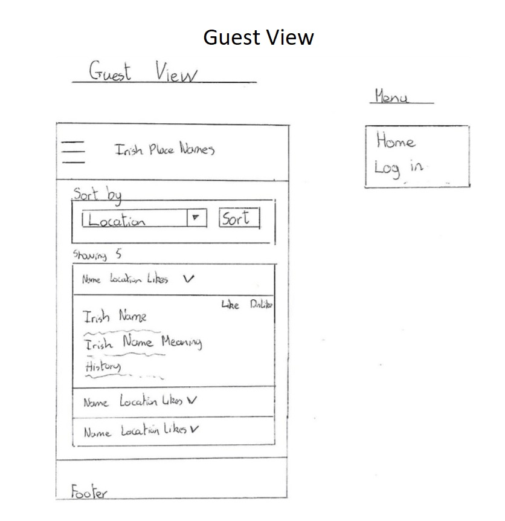

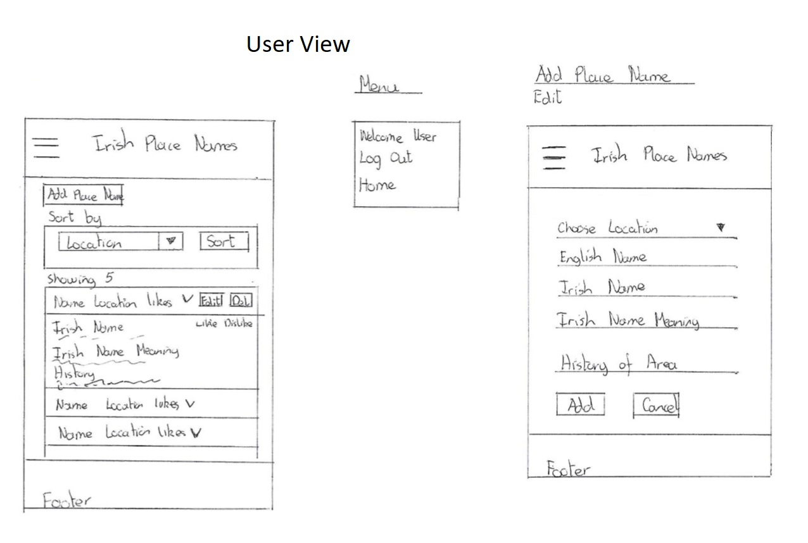

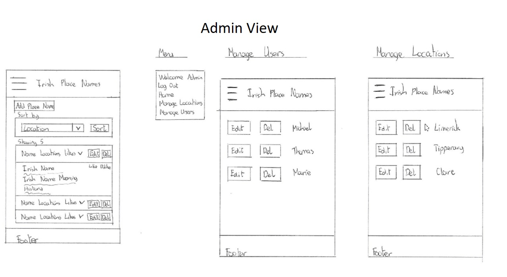

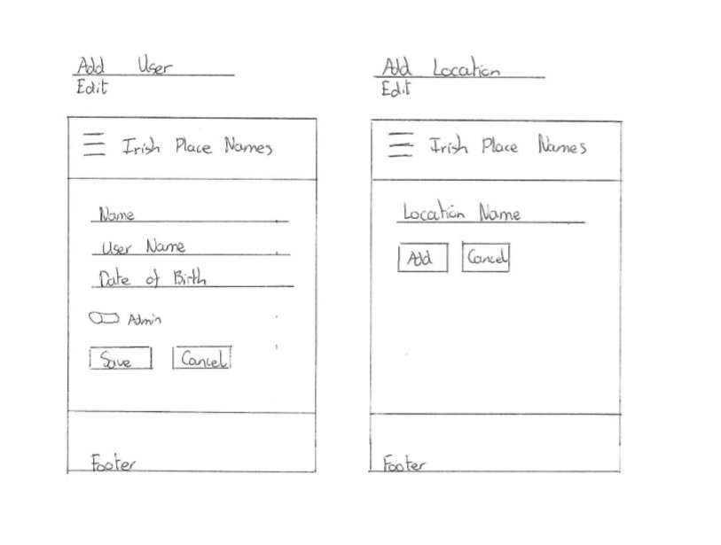

## Features

Below is the list of features added to provide the website functionality. Future features that are planned to be added are listed in the future feature section “[Future Features](#future-features)”

-   Login – Users that are registered in the system can log in. Users are given either user privileges or admin privileges depending on login details.

-   View Place Names – show all place names entered by all users - different menus and options are shown based on the users privileges 
    ([placeNames.html](https://github.com/michaelhdev/project-3/blob/master/templates/placeNames.html).

-   Add Place Name – allows a user to add a place name (Privileges - user or admin)
    ([addPlaceName.html])(https://github.com/michaelhdev/project-3/blob/master/templates/addPlaceName.html))

-   Edit Place Name – allows the user who created the place name to edit the place name (Privileges - user or admin)
    ([editPlaceName.html])(https://github.com/michaelhdev/project-3/blob/master/templates/editPlaceName.html))

-   Delete Place Name - allows a user to delete a place name they have added (Privileges - user or admin)

-   Manage Users – view and manage users information (Privileges - admin) (https://github.com/michaelhdev/project-3/blob/master/templates/users.html)

-   Add User – add user information if the user does not already exist (Privileges - admin)
    ([addUser.html])(https://github.com/michaelhdev/project-3/blob/master/templates/addUser.html)

-   Edit User – edit user information (Privileges - admin)
    ([editUser.html])(https://github.com/michaelhdev/project-3/blob/master/templates/editUser.html)

-   Delete User - allows an admin to delete a user and information they have entered (Privileges - admin)

-   Manage Locations – view and manage location information (Privileges - admin)
    ([locations.html])(https://github.com/michaelhdev/project-3/blob/master/templates/locations.html)

-   Add Location – add location information if the location does not already exist (Privileges - admin)
    ([addLocation.html])(https://github.com/michaelhdev/project-3/blob/master/templates/addLocation.html)

-   Edit Location – edit location information (Privileges - admin)
    ([editLocation.html])(https://github.com/michaelhdev/project-3/blob/master/templates/editLocation.html)

-   Delete location- allows an admin to delete a location and information associated with that location (Privileges - admin)

-   Sort place names based on selected option

-   Allow users to like dislike place names and display the number of likes a place name has

Interface
===============
## Guest View

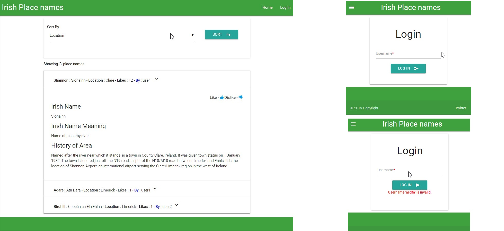

## User View

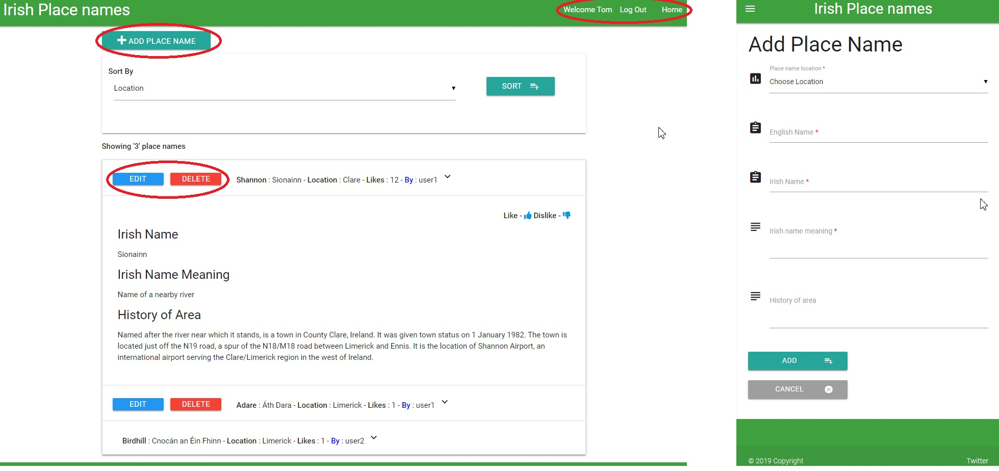

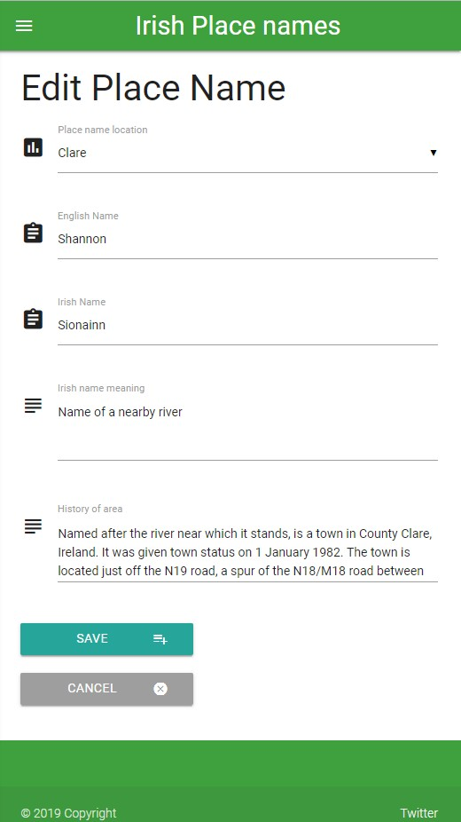

## Admin View

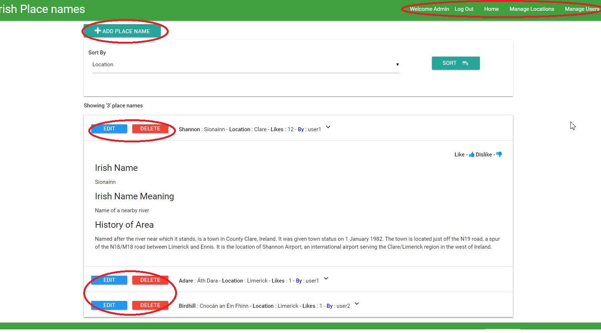

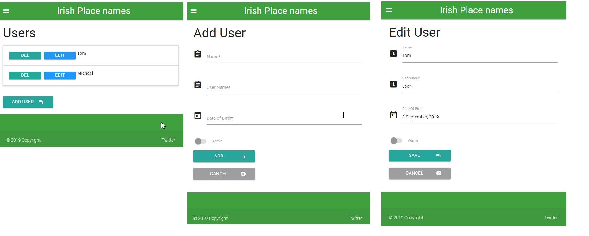

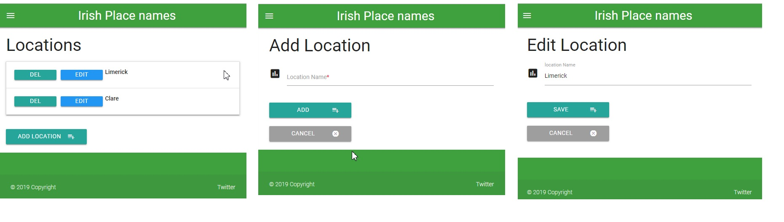

Future Features
===============

If the scope of the project was to be extended the following features should be added:

1.  Authentication – proper password authentication

2.  Live Search – live search to check if a place name the user is searching for is in the system and display an add button if the place name does not exist.

3.  Google location – incorporate the google api to display the location of the place name

4. Advanced admin capabilities – to show number of place name views, most active user etc.

5. Place name of the day – display a place name of the day on the homepage

Database Schemas
================

This project consists of three tables. The schema for each is presented
below:

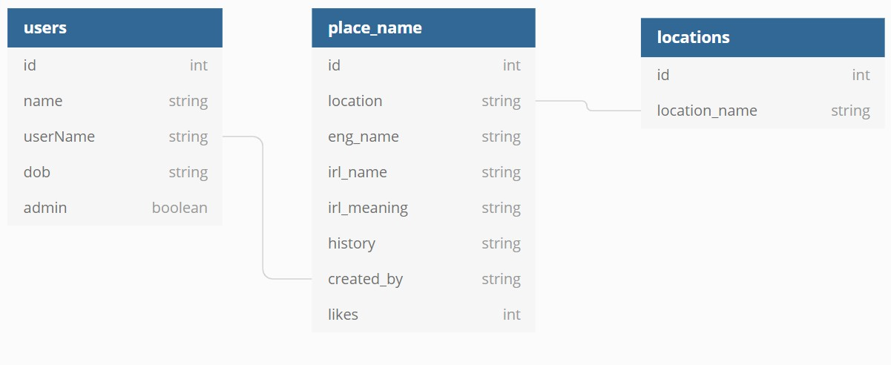

Technologies Used
=================

The list of technologies used for this project in no specific order.

1. HTML5

2. CSS

3.  JavaScript and [jQuery](https://jquery.com/) v3.2.1

4. [Materialize front-end framework v0.100.2](http://archives.materializecss.com/0.100.2/)

5.  [Python](https://www.python.org/downloads/) v3.6.8

6.  [FLASK](http://flask.pocoo.org/) v1.1.1

7.  [Jinja2](http://jinja.pocoo.org/docs/2.10/)

8.  Pip3

9.  [MongoDB](https://www.mongodb.com/)

10. [Heroku](https://www.heroku.com/)

11. [Google fonts](https://fonts.google.com/)

12. Chrome and Firefox developer tools

13. [Git/Github](https://github.com/michaelhdev/project-3)

14. AWS Cloud9

## Testing
The use cases were used during testing to enuser the expected result was returned. In cases where the expected result was not return the code was investigated and when the 
problem was found it was rectified. Debugging was also turned on during development and console logs were used to ensure the expeced values were in variables whenever a problem was encounterd.

## Use Cases and expected results

### Guest tests
### The guest wants to view the Irish name and meaning of a place name: 
- The guest goes to the home page of the site. All the placenames within the system are listed. 
- If the guest selects a place name it opens an accordian element to display more information about the place name. 
- The place name, the Irish place name, the Irish meaning of the place name, the history of the place name, the location of the place name, the number of likes and the user who entered the place name are all visable to the user.

### The guest wants to like or dislike an uploaded Irish Place Name:
- The guest selects an irish place name and the accordian view opens up.
- The guest clicks on the thumbs down icon => the likes count is decremented by one
- The guest clicks on the thumbs up icon => the likes count is incremented by one

### The guest wants to sort place names based on likes, location, alphabetic order and created by:
- The guest selects likes from the selection box and presses sort -> The place names are returned ordered by likes.
- The guest selects location from the selection box and presses sort -> The place names are returned ordered by location.
- The guest selects name from the selection box and presses sort -> The place names are returned ordered by in alphabetical order based on placenames.
- The guest selects created by from the selection box and presses sort -> The place names are returned ordered by who created them.

### User tests
### The user wants to login
- The user selects the login button on the menu bar
- The user is taken to a login page where they can enter login details. 
- If the correct login details are entered they are taken to the user homepage. 
- If the incorrect login details are entered they remain on the login page and an error message is displayed.

### The user wants to add a place name 
- The user clicks on the “Add Place Name” button which only displays on the homepage when the user is logged in. 
- The user is taken to the add place name page where the can enter the place name details. 
- When the user clicks the add button, if the form is not empty and the place name does not exist in the database, the place name is added and the user is returned to the list of place names where the place name they have beed editing is expanded. 
- If the form is empty or the place name already exists the user is returned to the add place name page with an error message displayed.

### The users wants to edit a place name they have added 
- The user clicks on the edit button beside the place name, which only displays on the place names they have created. 
- The edit place name page is displayed containing the values already in the system. 
- The user edits the details and clicks “Save Changes”.
- If the form is not empty and the place name has not been changed to a name that already exists the place name is updated and The user is returned to the home page where they can view all the place names and where the place name they have beed editing is expanded.
- If the form fields are changed to empty of a name is changed to a name that already exists and error is displayed

### The user wants to delete a place name that they have entered 
- The user clicks on the delete button beside the place name. The delete button is only displayed beside place names that user has entered. 
- The place name is deleted and the user is returned to the homepage where all the place names are displayed.

### The user wants to like or dislike an uploaded Irish Place Name:
- The user selects an irish place name and the accordian view opens up.
- The user clicks on the thumbs down icon => the likes count is decremented by one
- The user clicks on the thumbs up icon => the likes count is incremented by one

### The user wants to sort place names based on likes, location, alphabetic order and created by:
- The user selects likes from the selection box and presses sort -> The place names are returned ordered by likes.
- The user selects location from the selection box and presses sort -> The place names are returned ordered by location.
- The user selects name from the selection box and presses sort -> The place names are returned ordered by in alphabetical order based on placenames.
- The user selects created by from the selection box and presses sort -> The place names are returned ordered by who created them.

### The user wants to log out
- The user click the “log out” button. 
- The users is return to the homepage where they no longer have the options to add place names or edit and delete the place names they have added

### Admin tests
### The admin wants to login 
- The admin clicks the login button on the home page. 
- The admin is taken to a login page where they can login. 
- If the correct login details are entered they are taken to the user homepage. 
- If the incorrect details are entered they are displayed with an error message on the login page.

### The admin wants to mange site users 
- The admin clicks on the “Mange Users” button in the menu bar. This option is only displayed with admin privileges 
- The admin is take to the manage users page where they can edit, add or delete users.

### The admin wants to add a user 
- On the manage users page the admin clicks the “Add User” button. 
- The admin is taken to the add user page where they fill in the user details. 
- The admin clicks the add user button. 
- If the form is filled and the user does not already exist, the user is added to the system and the admin is returned to the list of user. 
- If the user exists or no details have been entered an error is displayed on the page.

### The admin wants to edit a user 
- The admin clicks on the edit button beside the user. 
- The edit user page is displayed. 
- The admin edits the details and clicks “Save”. 
- If the form is not empty and the user has not been changed to a name that already exists the user is updated.
- The admin is returned to the manage users page where they can view all the users.

### The admin wants to delete a user
- The admin clicks on the delete button beside the user name. 
- The user is deleted along with all the place names they have added on the system. 
- The admin is returned to the manage users page where all the users on the system are displayed.

## The admin wants to mange place names locations 
- The admin clicks on the “Mange locations” button in the menu bar. 
- The admin is taken to the manage locations page where they can edit, add or delete locations.

## The admin wants to add a location 
- On the manage location page the admin clicks the “Add location” button. 
- The admin is taken to the add location page where they fill in the location details. 
- The admin clicks the add location button. 
- If the form is filled in and the location does not already exist in the system, the location is added and the admin is returned to the list of location. 
- If the location exists or no details have been entered an error is displayed on the page.

## The admin wants to edit a location
- The admin clicks on the edit button beside the location. 
- The edit location page is displayed. 
- The admin edits the details and clicks “Save”. 
- If the form is not empty and the location has not been changed to a name that already exists. The location is updated and The admin is returned to the manage locations page where they can view all the location on the system.
- If the location exists or no details have been entered an error is displayed on the page.

## The admin wants to delete a location 
- The admin clicks on the delete button beside the location name. 
- The location is deleted along with all the place names that were added under that location in the system. 
- The admin is returned to the manage locations page where all the locations on the system are displayed.

## The admin wants to add, edit, delete a place name 
- The same testing proceture as for adding, deleting and editinn a place name for guest and user

### The admin wants to like or dislike an uploaded Irish Place Name:
- The admin selects an irish place name and the accordian view opens up.
- The admin clicks on the thumbs down icon => the likes count is decremented by one
- The admin clicks on the thumbs up icon => the likes count is incremented by one

### The admin wants to sort place names based on likes, location, alphabetic order and created by:
- The admin selects likes from the selection box and presses sort -> The place names are returned ordered by likes.
- The admin selects location from the selection box and presses sort -> The place names are returned ordered by location.
- The admin selects name from the selection box and presses sort -> The place names are returned ordered by in alphabetical order based on placenames.
- The admin selects created by from the selection box and presses sort -> The place names are returned ordered by who created them.

### The admin wants to log out
- The admin click the “log out” button in the menu bar. 
- The admin is return to the homepage where they no longer have the options to add edit delete place names, manage users and manage locations

## During testing
---------------
- likes were not incrementing and decremending consistently - Passed
- likes were ordering lowest to highest, the preferred result would be hightest to lowest. -Passed
- empty form validation is not enabled for the edit forms - Passed
- when editing a usern - if the user is changed to a username that already exits, an error message appears but the user is returned to the addUser.html instead of the editUser.html Passed
- only one of the users placenames was deleting when the user was deleted from the system - Passed
- when editing a location - if the location is changed to a location that already exits, an error message appears but the user is returned to the addLocation.html instead of the editLOcation.html Passed
- when a location name is updated, the name is not updated in the place-names database. Fail
- If a location is deleted its correspoinding placenames are not getting deleted - Passed
- For admin name does not appear to be ordering propperly - Passed

## Responsiveness Testing
The responsiveness was tested extensively on different devises using and Chromes developement tools.

## Deployment

This project is deployed using [Heroku](https://id.heroku.com/login) 

- [Website](https://place-name-app.herokuapp.com/#active)

Git was also used extensively throughout this project to back up files from Cloud 9

The project was developed and tested in Cloud9. It was also pushed to Heroku at and early stage in the project and then updated incrementially. 

The mongoDB name and URI were added as environment varialbles along with the usual IP and PORT variables.

Deployment worked seemisly and there were never any issues deploying from Cloud 9

## Credits

### Content
- Information placenames was taken from [Wikipedia Monkees Page](https://en.wikipedia.org/wiki/The_Monkees)

### Acknowledgements

- I received inspiration for the materialize navigation bar from projects presented during the code institute course. 

